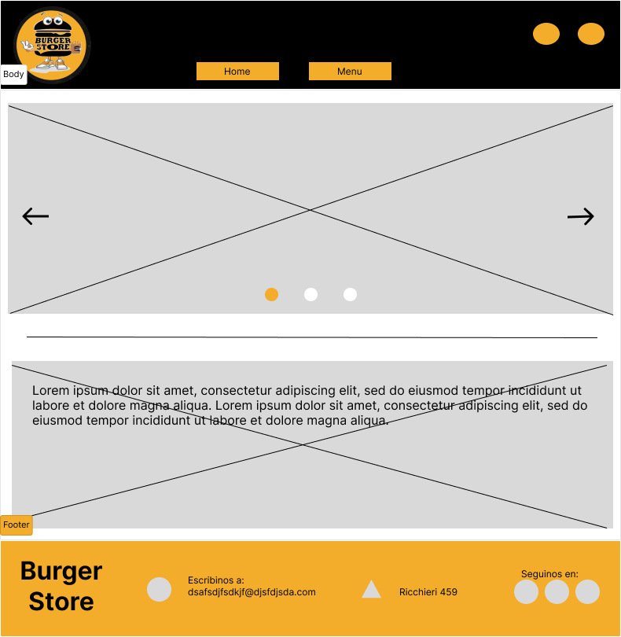
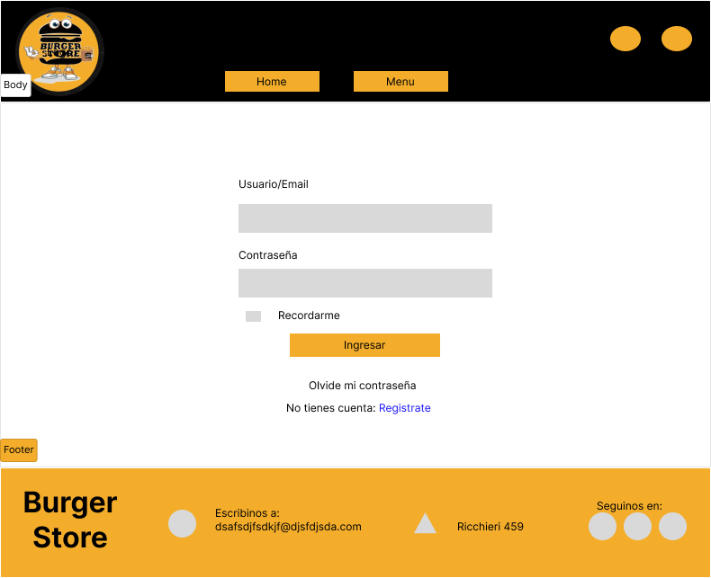
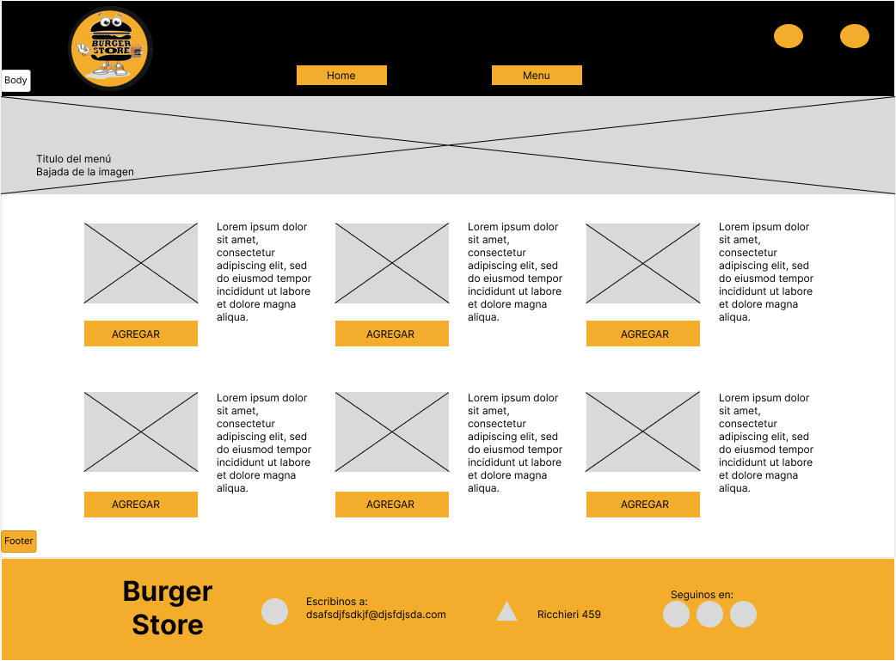
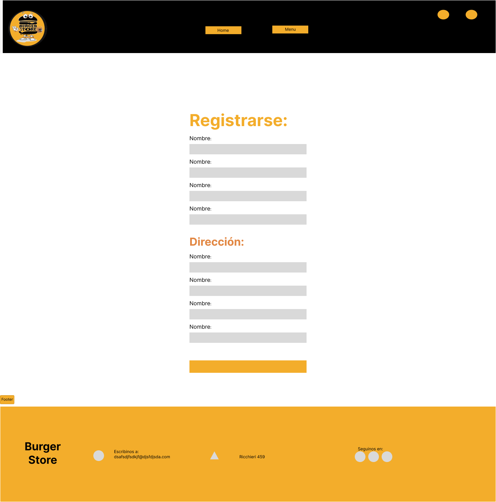
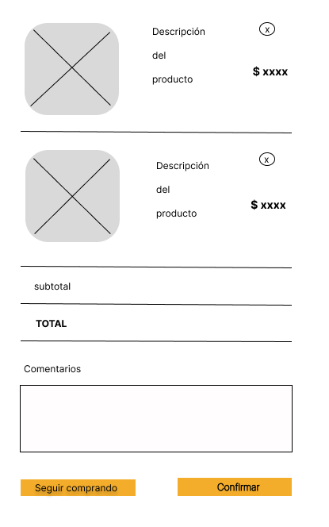
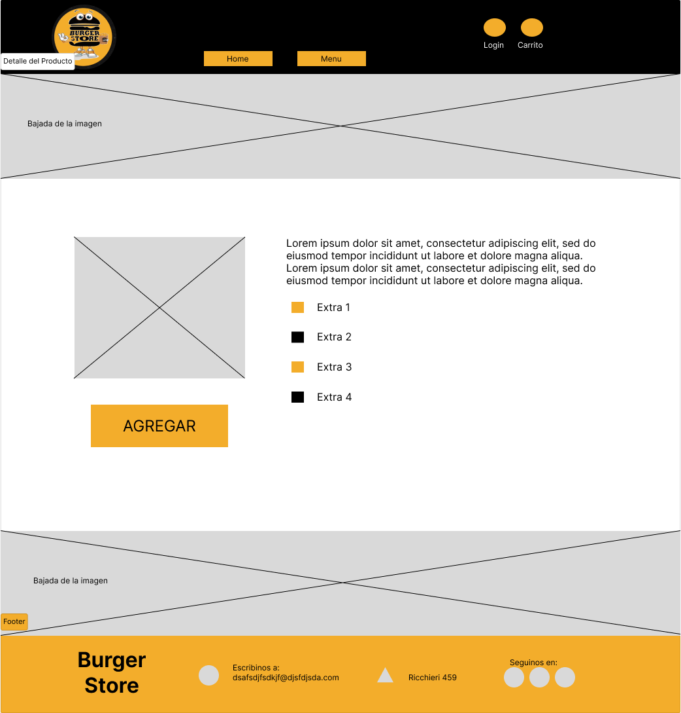

# Burger store



## Introducción

Nuestra idea es hacer una Web de una hamburgueseria de la Zona que vende en su local y por delivery. Su nombre es Burger Store. La propuesta apunta a todo el publico en general. Esta haburgueseria por el momento solo ofrece distintas variedades de hamburguesas y las combina con papas fritas. Hay hamburguesas pre-armadas pero tambien se pueden agregar extras y armarla a gusto. Se ofreceran las opciones de comer en el local, take-away, delivery propio y Pedidos-ya.
## Ejecutar aplicación
- Si es la primera vez que se va a usar la aplicación ejecutar los siguentes comandos:
```
npm install
npm start
```
- Para ejecutar la versión __developer__ ejecutar:
```
npm run test
```
## Recursos
Se usaron como inspiracion las siguientes paginas web:
- https://deananddennys.com/
- https://www.bigpons.com.ar/
- https://www.centralburgers.es/
- https://tiktakhouse.es/categoria-producto/hamburguesas/
- https://www.noshup.com.ar/
- https://kravejerky.com/pages/shop

## Grupo
Los integrantes del Equipo somos: 
- Mi nombre es Marina Deregibus, soy profe de inglés y jefa de departamento. Soy fan de los autos y la Fórmula 1, pero también me gusta mucho la ciencia ficción, los cómics, mangas y animes. En mis tiempos libres me gusta jugar videojuegos, hobby que me llevó a interesarme por la programación.
- Mi nombre es Leonardo (Leo) Finkelberg, tengo 40 años estoy casado y con 2 hijos. Vivo en Bella Vista. Soy administrador de empresas y actualmente también comencé a trabajar como PM en una compañía de Software. Ya realice otros cursos de IT tales como QA, Ciberseguridad y algunos de Redes informáticas. Me gusta mucho el mundo tecnológico por lo que estoy buscando cambiar a este sector.
- Mi nombre es Luciano (Lucho) Bado, tengo 22 años y vivo en Bella Vista. Estudié 3 años en la carrera licenciatura en sistemas de la Universidad Nacional de General Sarmiento (UNGS), por lo cual ya tengo un poco de experiencia programando con lenguajes como Python y Java. Actualmente estoy desempleado, previamente trabajé como Project Manager (PM) en una compañía de software a medida. Mi intención es ir ganando experiencia como programador lo antes posible, razón por la cual estoy en este curso.
- Mi nombre es Sonia Villafañe, vivo en San Miguel. Soy Terapista Ocupacional egresada de la UBA y me dedico a esta profesión hace más de 20 años. Me decidí a comenzar programación porque es algo pendiente desde que terminé el secundario y lo pienso a corto plazo como trabajo complementario al actual y a futuro quizás full time.
- Mi nombre es  Matías Arévalo, vivo en San Miguel. Me gusta mucho la programación web y de software. Actualmente estoy estudiando en la Universidad General Sarmiento Licenciatura en sistema e Inglés en el instituto superior cultura Británica. Trabajo como soporte de aplicación en Volkswagen Pacheco. Me gusta cocinar, ver películas y escribir. Busco oportunidades que desafíen mi creatividad y mi profesionalismo.

## Rutas
### Consultas de productos
```
# Listado y eliminación de productos.
/products

# Formulario de edición de un producto.
/product/:id

# Crear un producto.
/products/create

```

## Interfaz

### Login

### Menu

### Registro

### Carrito

### Detalle de Productos

